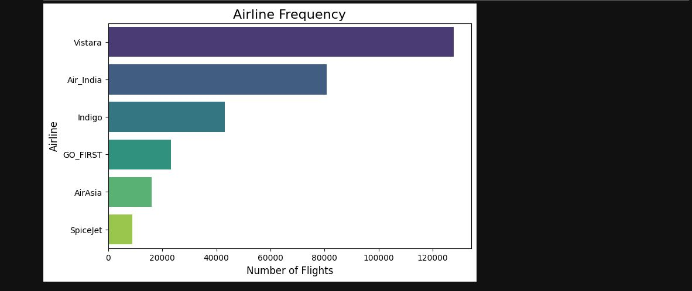
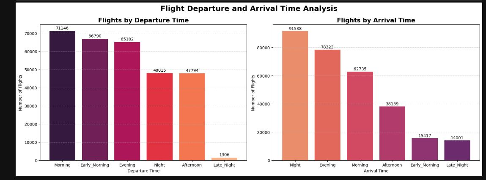
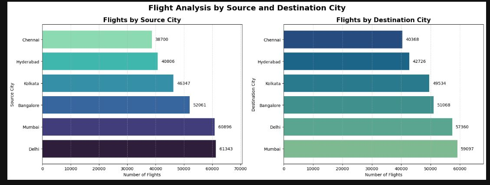
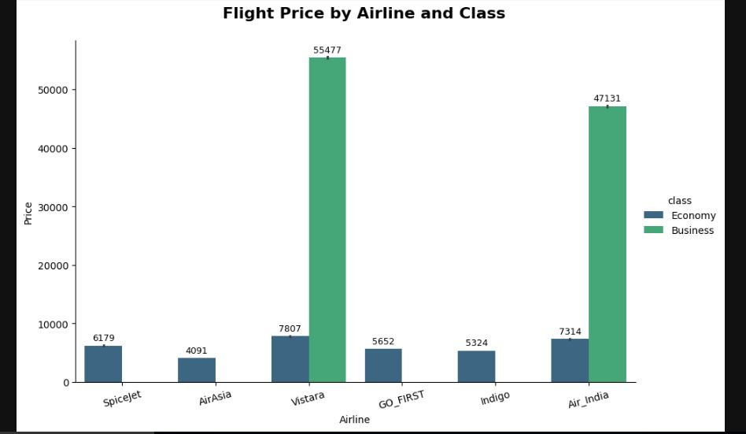
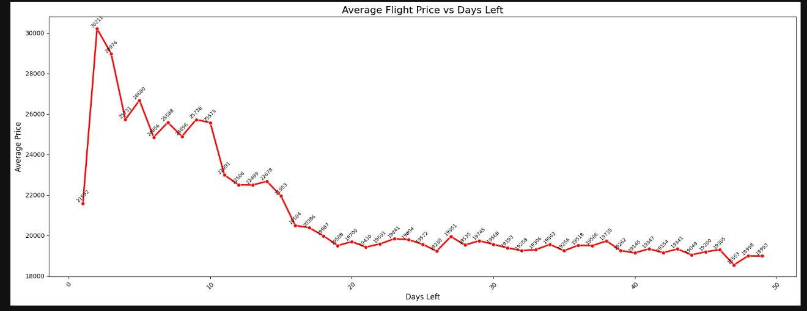

# ✈️ Commercial Aviation Pricing Analysis & Revenue Analytics

---

## 📌 Table of Contents
- [Overview](#-overview)
- [Key Highlights](#-key-highlights)
- [Dataset Architecture](#-dataset-architecture)
- [Analytical Workflow](#-analytical-workflow)
- [Visualizations & Core Inferences](#-visualizations)
- [Strategic Business Insights](#-strategic-business-insights)
- [How to Run](#-how-to-run)
- [Author & Contact](#author--contact)

---

## 📊 Overview

Yield management in the commercial aviation industry is driven by volatile pricing algorithms determined by scheduling constraints, routing networks, and tiering infrastructure. This project conducts a programmatic, multi-variable Exploratory Data Analysis (EDA) on a dataset consisting of **300,153 domestic flight records** across primary Indian metropolitan hubs. 

By analyzing the correlation between booking lead times, class categories, time-of-day slots, and operational routings, this analysis converts raw transactional engine logs into high-impact corporate pricing intelligence.

---

## 🚀 Key Highlights

* **Volumetric Fleet Representation:** Processed massive dataset patterns spanning 6 major legacy and low-cost carriers (LCCs).
* **Granular Micro-Market Routing:** Isolated pricing mechanisms between 6 primary high-density metropolitan source and destination nodes.
* **Deterministic Yield Discovery:** Uncovered stark, asymmetric pricing structures mapping LCC economy strategies vs. premium full-service airline (FSA) business models.
* **Time-Series Horizon Mapping:** Documented dynamic, non-linear fare trajectories relative to booking urgency (`days_left`).

---

## 🗃️ Dataset Architecture

* **Source:** National Flight Booking Transaction Engine Logs (`airlines_flights_data.csv`)
* **Volume:** `300,153` records | `11` features (post-cleaning)

### Core Features Reference Table
| Column Name | Data Type | Analytical Class | Functional Significance |
| :--- | :--- | :--- | :--- |
| `airline` | Object | Categorical | Operating carrier (Vistara, Air India, Indigo, etc.) |
| `flight` | Object | Identifier | Unique alphanumeric tracking ID |
| `source_city` | Object | Spatial | Departure metropolitan airport hub |
| `departure_time`| Object | Temporal | Time-of-day category for flight takeoff |
| `stops` | Object | Categorical | Direct/Indirect node routing metric (`zero`, `one`, `two_or_more`) |
| `arrival_time` | Object | Temporal | Time-of-day category for flight destination landing |
| `destination_city`|Object | Spatial | Target destination airport hub |
| `class` | Object | Categorical | Service level segment (`Economy` vs. `Business`) |
| `duration` | Float | Continuous | Total travel duration in fractional hours |
| `days_left` | Integer | Discrete | Lead time (number of days prior to departure) |
| `price` | Integer | Continuous | Dependent target variable (ticket price in INR) |

---

## 🔄 Analytical Workflow

1. **Ingestion & Integrity Check:** Data is read using `pandas.read_csv()`. Checked feature dimensions via structural inspections (`.info()`, `.isnull().sum()`). Null records returned zero value anomalies across all planes.
2. **Dimensionality Refinement:** Dropped redundant arbitrary storage arrays (`index`) to enforce strict tidiness.
3. **Segmentation Mapping:** Computed operating frequencies and targeted market concentrations across discrete categoricals using value-counts vectorization.
4. **Statistical Pivot Computations:** Aggregated transactional subsets via `.groupby()` parameters to measure central tendencies (means) across spatial, categorical, and diurnal horizons.
5. **Data Visualization:** Built descriptive multi-axis seaborn frameworks evaluating structural distribution variations.

---

## 🎨 Visualizations

### 1. Airline Frequency

### 2. Flight Departure & Arrival Time Analysis

### 3. Flights By Source & Destination Cities

### 4. Flight Price by Airline & Class

### 5. Average Flight Price VS Days Left

---

## 💡 Strategic Business Insights

* **The Business Class Premium:** Premium services skew baseline ticket pricing models. For instance, a Vistara flight operating along the high-density **Delhi ➔ Hyderabad** corridor maintains an average ticket price of **`₹47,939.84`** when isolated for Business Class cabins.
* **Operational Routing Premiums:** Flight paths traversing Delhi are consistently priced lower on average (`~₹18.4K-₹18.9K`) than routes processing out of Chennai or Kolkata (`~₹21.9K`), implying localized market competition variations or differences in average flight length.

---

## 💻 How to Run
* **Prerequisite Dependencies**
Ensure that your Python execution environment includes pip packaging systems.

pip install pandas numpy matplotlib seaborn
* **Running the Environment**
1.Clone this repository to your filesystem:

git clone [https://github.com/yourusername/flight-revenue-analytics.git](https://github.com/yourusername/flight-revenue-analytics.git)
cd flight-revenue-analytics
2.Launch the analysis environment:

jupyter notebook "Flight data analysis.ipynb"

---

## Author & Contact

**Author:** Vivek Deore

📧 Email: vivekkdeore001@gmail.com

🔗 LinkedIn: https://linkedin.com/in/vivekkdeore

🔗 GitHub: https://github.com/vickykd-5

`#python` `#pandas` `#exploratory-data-analysis` `#data-visualization` `#revenue-management`, `#airline-industry` `#aviation-analytics` `#data-cleaning` `#seaborn`, `#matplotlib` `#business-intelligence` `#yield-optimization` `#data-science` `#analytics-engineering`
